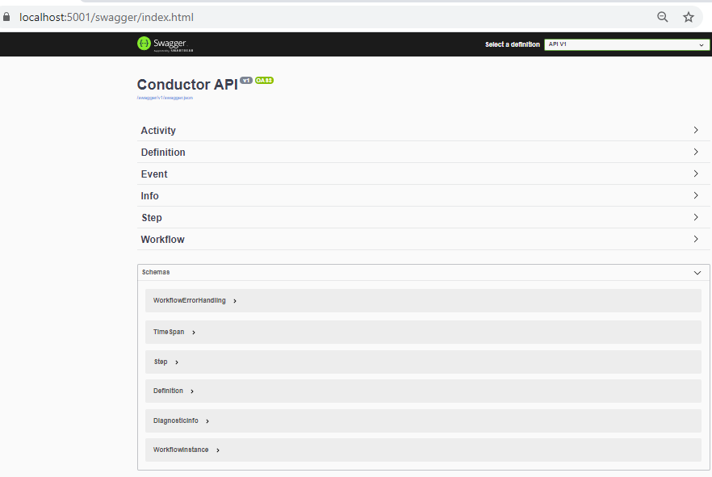
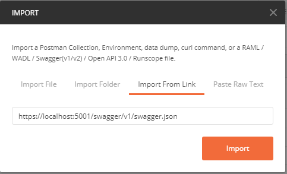

* [Definitions](#definition-api)
* [Workflows](#workflow-api)
* [Events](#event-api)
* [Activity Workers](#activity-api)
* [Custom Steps](#steps-api)
* [Diagnostics](#diagnostic-api)
* [Swagger documentation](#swagger-documentation)

Download the [Postman Collection](https://raw.githubusercontent.com/danielgerlag/conductor/master/docs/Conductor.postman_collection.json)

# Definition API

## Create or update a definition

We `POST` the definition to `api/definition` in either `YAML` or `JSON`.

```http
POST /api/definition
Content-Type: application/yaml
```
```yml
Id: Hello1
Steps:
- Id: Step1
  StepType: EmitLog
  NextStepId: Step2
  Inputs:
    Message: '"Hello world"'
    Level: '"Information"'
- Id: Step2
  StepType: EmitLog
  Inputs:
    Message: '"Goodbye!!!"'
    Level: '"Information"'
```

Posting to a definition ID that already exists, will create a second version of that workflow definition and all existing workflows that were started on the old verison, will continue on the old version but all workflows that are started after this will run on the new version.


# Workflow API

## Start a workflow

To start a workflow, submit a `POST` to `/api/workflow/<<DefinitionId>>`, where the body of the request will be the initial data object passed to the new workflow instance.

```
POST /api/workflow/<<DefinitionId>>

```
Example: Start the `HelloWorld` workflow, with some custom data.
```
POST /api/workflow/HelloWorld
Content-Type: application/x-yaml
```
```yaml
CustomMessage: foobar
```

#### Response

```json
{
    "workflowId": "5d26ae05ec9ce50001bc9c2a",
    "data": {
        "CustomMessage": "foobar"
    },
    "definitionId": "HelloWorld",
    "version": 1,
    "status": "Runnable",
    "reference": null,
    "startTime": "2019-07-11T03:33:25.203Z",
    "endTime": null
}
```

## Querying a workflow

If you have the `workflowId` that you get back when you start a workflow, you can query it's status via the API.

```
GET /api/workflow/<<WorkflowId>>
```

#### Response

```json
{
    "workflowId": "5d26ae05ec9ce50001bc9c2a",
    "data": {
        "CustomMessage": "foobar"
    },
    "definitionId": "HelloWorld",
    "version": 1,
    "status": "Runnable",
    "reference": null,
    "startTime": "2019-07-11T03:33:25.203Z",
    "endTime": null
}
```

## Suspending a workflow

You can suspend a workflow with a `PUT`

```
PUT /api/workflow/<<WorkflowId>>/suspend
```


## Resuming a workflow

You can resume a suspended a workflow with a `PUT`

```
PUT /api/workflow/<<WorkflowId>>/resume
```

## Terminting a workflow

You can abort a workflow with a `DELETE`

```
DELETE /api/workflow/<<WorkflowId>>
```


# Event API

You can publish an event with a particular name and key and attach some data to all workflows that may be listening to it.  Use the event API.

```
POST /api/event/<<name>>/<<key>>
```
```
<<data>>
```

# Activity API

An activity is defined as an item on an external queue of work, that a workflow can wait for.

## Getting a pending activity 

To fetch a waiting activity of an active workflow.  
```
GET /api/activity/<<name>>?workerId=<<workerId>>&timeout=30
```

* `name` (required) is the activity name to fetch waiting work for.
* `workerId` (optional) is an identifier of the worker pulling the work.
* `timout` (optional) number of seconds to block while waiting for an activity.

#### Response

If there is no workflow waiting on the activity requested, then a `404 Not Found` will be returned.
If there is work waiting for that activity name, then an exclusive token will be issued and the reponse will look as follows

```json
{
    "token": "...",
    "activityName": "...",
    "parameters": {},
    "tokenExpiry": "9999-12-31T23:59:59.9999999"
}
```
* `token` An exclusive token is issued to the worker to use in future requests for this activity.
* `parameters` The input data that the workflow attached to this actvity.
* `tokenExpiry` When the token expires and the activity will be made available to other workers.


## Submitting a result for an activity 

To submit a successful response to an activity and pass some response data back to the workflow in the body of the request.

```
POST /api/activity/success/<<token>>
```
```
<<data>>
```

To submit a failure response to an activity and pass some response data back to the workflow in the body of the request.

```
POST /api/activity/fail/<<token>>
```
```
<<data>>
```

## Release a token

To release a token held by a worker, so that another worker could pick it up.

```
DELETE /api/activity/<<token>>
```


# Steps API

Conductor also allows you to define your own steps that can be used within your workflows.  Currently, the only supported language is Python.  More languages will be implemented in the future.

## Creating a step

The following call creates a step called `add`, which is a Python script that sets c to a + b
```
POST /api/step/add
Content-Type: text/x-python
```
```python
c = a + b
```

## Viewing a step

```
GET /api/step/<<id>>
```


# Diagnostic API

```
GET /api/info
```


# Swagger Documentation

It is possible to discover and try out API with [Swagger](https://swagger.io/) in a browser `https://localhost:5001/swagger`.



It’s also convenient to import a Postman collection as swagger json `https://localhost:5001/swagger/v1/swagger.json`.

